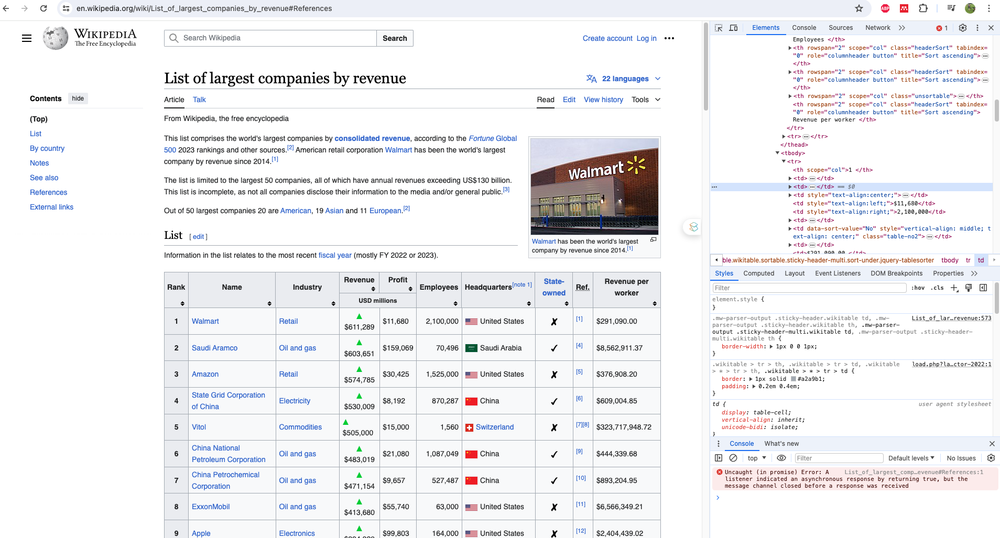
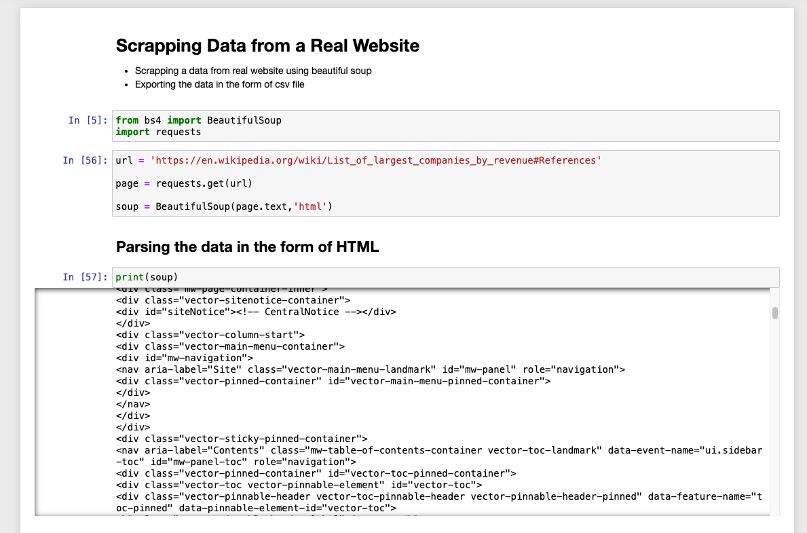

# Web Scraping Project With BeautifulSoup and requests


1. ## Overview

This project demonstrates how to use and requests libraries in python to scrape and extract data from Web browser of wikipedia with largest companies in the world.

We used inspect tool from the browser by right clicking the mouse..



2. ## Features
- **Data Extraction:** Extracts key company details from the first table present in the webpage such as Rank, Name, Industry, Revenue, Profit, Headquaters, and so on the columns details.

- **HTML Parsing:** Efficiently parses HTML content to identify and extract specific data points.

- **Data Cleaning:** Cleans and formats extracted data for better readibility.

- **Exporting the Data to local Machine:** After extracting the data exports the data in the form of csv format for further use.


3. ## Prerequisites
- python 3.x
- pip

4. ## Installation

- **Clone the repository:**
``` bash
git clone https://github.com/Adigo45/WebScrapping.git
```

- **Navigate to the Project Directory:**

```bash
cd WebScrapping
```

- **Install the required packages:**
```bash
pip install -r requirements.txt
```
 This will install the  `beautifulsoup4` and `requests`  library for parsing the web page data.

### Sample Output
 
The data extracted from the webpage is present in `largest_companies.csv` file

5. ## Contributing

Pull requests are welcome. For major changes, please open an issue first to discuss what you would like to change.


6. ## License
This project is licensed under the MIT license. See `LICENSE` for more details.

